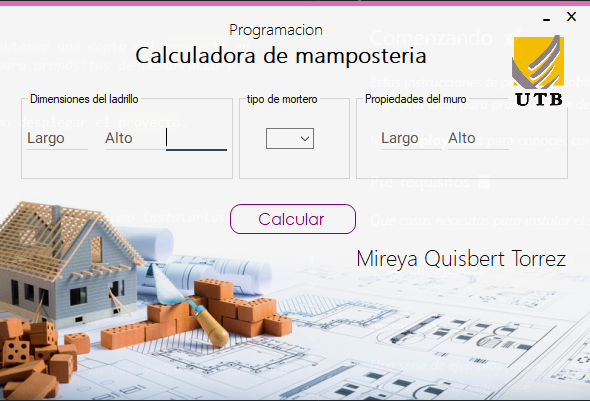

# Calculadora para mamposteria c#

calculadora para tener un aproximado de la cantidad de materiales       necesarios para una construccion

 

## Comenzando 🚀

_Estas instrucciones te permitirán obtener una copia del proyecto en funcionamiento en tu máquina local para propósitos de desarrollo y prueba_


### Pre-requisitos 📋

_Que cosas necesitas para instalar el software y como instalarlas_

```
.Net framework 4.5
```

### Instalación 🔧

_Una serie de ejemplos paso a paso que te dice lo que debes ejecutar para tener un entorno de desarrollo ejecutandose_


```
para visualizar el codigo ingresar al archivo: 
- Form1.cs
```
## Ejecutando las pruebas ⚙️

_el proyecto ya esta compilado solo es necesario ingresar a la siguente ruta_

```
CalculadoraParaMamposteria\bin\Debug
```

### Y ejecutar el archivo: ⌨️

```
CalculadoraParaMamposteria.exe
```

## Construido con 🛠️

* visual studio 2015

## Autores ✒️

* **Joel Quisbert**

Mas proyectos: [JDsoftware](https://github.com/aquila6555)
## Licencia 📄

Este proyecto está bajo la Licencia (JDsoftware).

## Expresiones de Gratitud 🎁

* Comenta a otros sobre este proyecto 📢
* contacto a : aquila6555@gmail.com 📧
* Invitame una cerveza 🍺 o un café ☕. 

---
⌨️ con ❤️ por JDevil 😊
